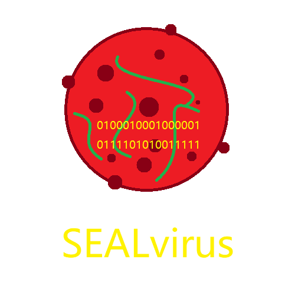

-----

# 项目跟进

最后一次提交 commit：

最新一次 release：

最新一次预览版 release：

当前打开的 issues 数量：

# SEALvirus 简介

~~SEALchan 在 2021.2.14 开始开发，在 2021.2.15 新建文件夹（~~

是 Paranoia Seal 联合 SEALchan Studio 大量使用批处理开发的病毒模块

这些模块大多来源于网络搜集，也有自己完成的代码

通过这些模块，你可以完成属于自己的病毒，当然，你可以任意利用该仓库中的代码，可以使用这些代码创建自己的应用而不必提及 P.S. 或 SCS（如果你可以，希望你能提及我们，支持我们的创作）

虽然我们没有办法侦测和防止，但我们仍然禁止你使用此处的代码在未经允许或他人的电脑上进行实验。同时，P.S. 和 SCS 对于实验中出现的虚拟机穿透或传播不负责任

每到一个月，我们会通过 release 的形式发布月度更新

月度更新将会将所有的模块进行综合处理，结合起来发布 SEALvirus 综合版本~~（揉合怪（~~

在该版本中，我们可能对病毒加壳或通过一系列方式避免病毒被当下的杀毒软件识别，以让爱好者们用来测试杀毒软件面对新病毒时的性能（例如特征码或启发）

我们会在 release 发布新病毒综合版的同时发布 AntiSv 的预防工具和专杀工具。病毒发布后 2hrs 左右，我们将会将病毒样本提交给热门杀软

你可以使用 AntiSv 专杀工具进行杀毒，但是请注意，SEALvirus 仅部分操作可被查杀，Sv 的代码中可能出现格式化和删除等不可逆操作，这样 AntiSv 也无能为力，所以请不要使用他人或未经允许的电脑

在最近的版本中，病毒不会局域网传播，但我们不保证今后的版本

# 怎样的设置才能更好的检测杀毒软件的性能？

安装杀软后，你可以选择不进行配置直接运行，也可以选择杀毒软件全家桶 + 功能全开启进行病毒运行，但请不要关闭杀毒软件的功能（除了广告等）

病毒的查杀包括对病毒源文件的扫描和运行时的查杀

病毒源文件可以为 exe，去掉扩展名的文件，或（含有密码的）压缩文件 [请在相应的杀毒软件中开启压缩文件查杀功能]

（Sv 可能会使用 exe2bat，但我们暂时不清楚杀毒软件如何查杀这类病毒）

若杀软在病毒开启时扫描了病毒源文件并且报毒而非运行时查杀，你可以选择关闭杀毒软件，在点击病毒后立刻打开杀软（也可以延时，以模拟用户反应）来查看杀软的杀毒水平

----

Enjoy it,

SEALchan P.S.

2021.2.15